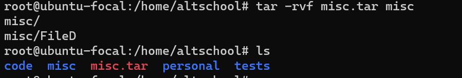

| Task                                                                                                             | Command                                                                                                               | Screenshot                                         |
| :--------------------------------------------------------------------------------------------------------------- | --------------------------------------------------------------------------------------------------------------------- | -------------------------------------------------- |
| a.Change directory to the tests directory using absolute pathname                                                | cd /home/altschool/tests                                                                                              |  |
| b.Change directory to the tests directory using relative pathname                                                | cd tests/                                                                                                             |  |
| c.Use echo command to create a file named fileA with text content ‘Hello A’ in the misc directory         | echo "Hello A" > FileA                                                                                                |  |
| d.Create an empty file named fileB in the misc directory. Populate the file with a dummy content afterwards | touch /home/altschool/misc/FileB   `base64 /dev/urandom \| head -c 1000 > /home/altschool/misc/FileB` |  |
| e.Copy contents of fileA into fileC                                                                              | cp FileA FileC                                                                                                        |  |
| f.Move contents of fileB into fileD                                                                              | mv FileB FileD                                                                                                        |  |
| g.Create a tar archive called misc.tar for the contents of misc directory                                        | tar -rvf misc.tar misc                                                                                                |  |
| h.Compress the tar archive to create a misc.tar.gz file                                                          | tar -czvf misc.tar.gz misc.tar                                                                                        |  |
| I. Create a user and force the user to change his/her password upon login                                        | sudo passwd --expire `<newuser>`                                                                                    |  |
| J. Lock a users password                                                                                         | sudo passwd -l `<user>`                                                                                             |  |
| K. Create a user with no login shell                                                                             | sudo useradd -s /usr/sbin/nologin `<newuser>`                                                                       |  |

---
L. Disable password based authentication for ssh

sudo nano /etc/ssh/sshd_config 
## set PasswordAuthentication no
## set PubkeyAuthentication yes
SAVE AND CLOSE
Restart SSH service >> sudo systemctl restart sshd

---

---
M. Disable root login for ssh

sudo nano /etc/ssh/sshd_config 
## PermitRootLogin no
SAVE AND CLOSE
Restart SSH service >> sudo systemctl restart sshd

---

